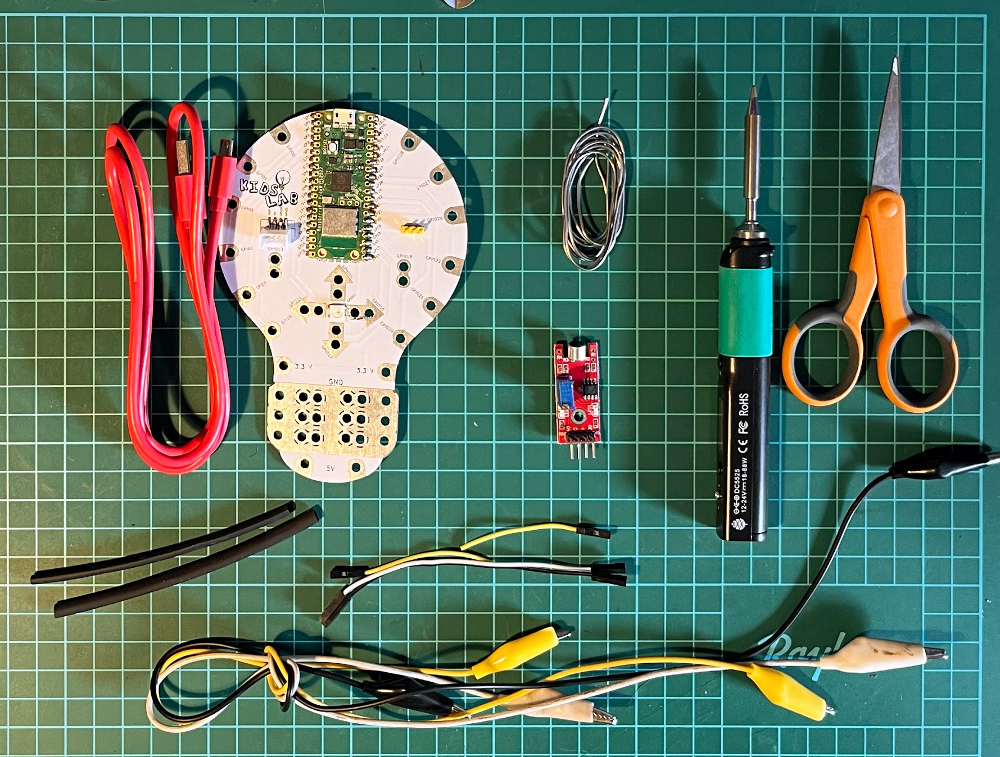
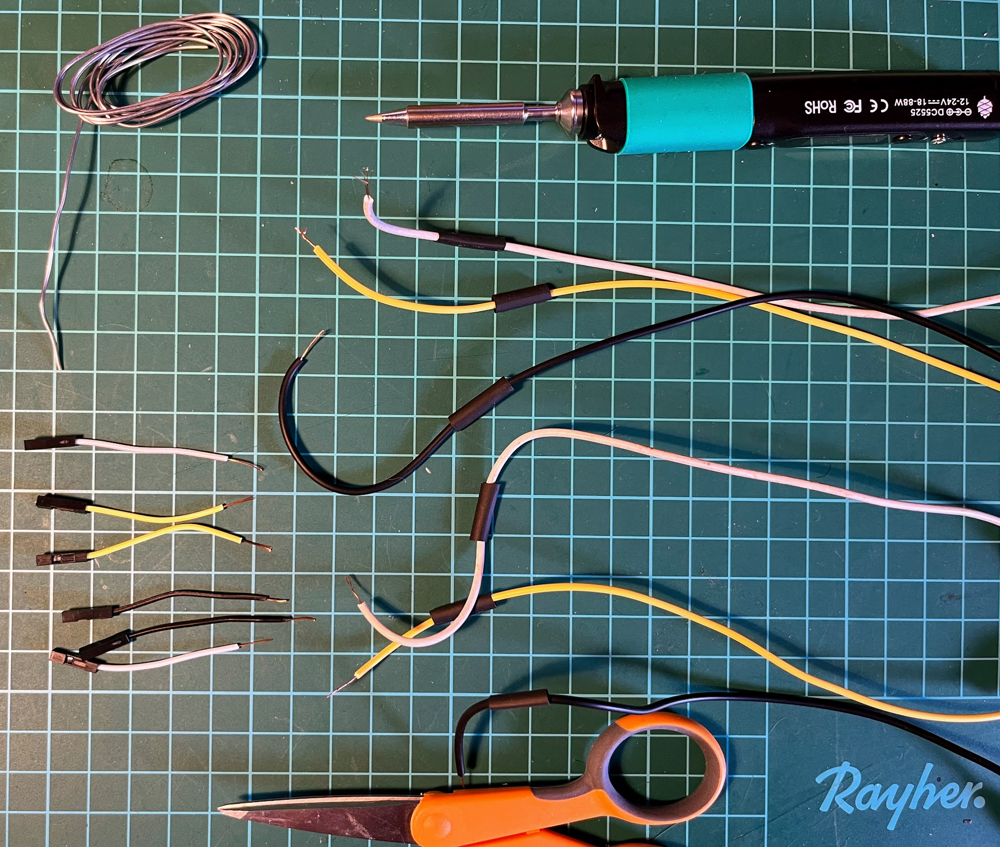
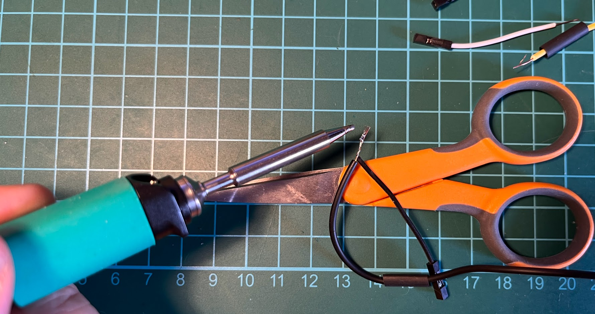

# Lautstärkemesser & Minecraft-Abschalter


Wenn wir mit KidsLab in live Minecraft-Workshops machen, wird es manchmal sehr laut: die Emotionen kochen hoch und es ist ja auch alles super aufregend! Aber die Ohren der Mentoren leiden manchmal sehr unter diesen Ausbrüchen.

Daher haben wir mit der PicoKrokoBirne einen Lautstärkemesser erfunden, der automatisch die Emotionen der Kids runterfährt: er friert alle in Minecraft ein, sobald es zu laut wird. Wie das Damals der [Herr Ivan Pertowitsch Pawlow](https://de.wikipedia.org/wiki/Iwan_Petrowitsch_Pawlow) mit seinen Hunden gemacht hat, lassen sich der Geräusch-Ausstoß der Kids vielleicht auch regeln.

## Was brauchst Du?



### Material

- PicoKrokoBirne mit Raspi Pico
- Lautstärke-Model (z.B. dieses [KY-038](https://sensorkit.joy-it.net/de/sensors/ky-038) gibts zum Beispiel hier: [Amazon AZ KY-038](https://amzn.to/3PhWPC4))
- Krokoklemmen & JumperKabel
- NeoPixel LED (optional)

## Vorbereitung

Bastel Dir aus den Krokoklemmen und JumperKabel die passenden Adapter, um das Lautstärke-Modul an die PicoKrokoBirne anzuschließen:






## Anschließen

- "+" kommt auf 3.3v
  - Der Sensor kann mit 3.3 oder 5 Volt betrieben werden - es muss aber jeweils die Empfindlichkeit anpassen

- "G" kommt auf GND
- D0 kommt auf einen digitalen Eingang, zum Beispiel GPIO0 


## Programmierung

### Lautstärke Messung

Das hat sich schwieriger herausgestellt als gedacht. Der Sensor sollte eigentlich am A0-Anschluss ein analoges Signal liefern: desto lauter, desto höher sollte die Spannung sein. Leider funktionierte das überhaupt nicht wie erwartet. Die Spannung veränderte sich nur sehr wenig, zu wenig, um die Lautstärke vernünftig zu messen.

Zuerst muss ich den Pin einrichten:

```python
import time
import board
from board import *
from digitalio import DigitalInOut, Direction, Pull

switch = DigitalInOut(board.GP0)
switch.direction = Direction.INPUT
switch.pull = Pull.DOWN
```


Der Sensor hat 2 Ausgänge: zusätzlich zu dem analogen auch einen digitalen: über den Dreh-Schalte (Potentiometer) auf der Platine, lässt sich eine Schwelle einstellen. Wenn diese überschritten ist, wird ein digitales Signal (0 Volt, 3,3 Volt) ausgegeben. Wenn man das "sammelt", das heißt über einen bestimmten Zeitraum zusammenzählt, erhält man einen guten Wert.

```python
while True:
		noiseLevel = 0;
    for x in range(100000):
        if switch.value:
            noiseLevel = noiseLevel +1
    if noiseLevel < 500:
        pixels.fill(GREEN)
    elif noiseLevel < 1500:
        pixels.fill(YELLOW)
    elif noiseLevel < 4000:
        pixels.fill(RED)
    else:
        pixels.fill(PURPLE)
    pixels.show()      
```

### Lautstärke kalibieren

Damit der Sensor richtig anspricht, müssen wir ihn noch Kalibrieren, also beibringen, was genau "zu laut" ist:

- Die **LED2** zeigt an, ab der Sensor anschlägt
- An der Schraube auf dem kleinen blauen Kästchen kannst du sie einstellen
- Drehe so lange, bis die LED ausgeht 
- Jetzt vorsichtig sol lange, bis sie blinkt, wenn es laute Geräusche gibt  

### Minecraft User einfrieren

Jetzt fehlt noch noch eines: wenn es zu laut ist, sollen die User in Minecraft eingefroren werden. Das machen wir über die Funktion des Pico, die HID heißt: er kann so tun, als ob er eine Tastatur ist. 

```python
    else:
        pixels.fill(PURPLE)
        typeIt("/der Befehl zum Einfrieren")
```

Die PicoKrokoBirne also nur noch am Rechner der Mentors anschließen - und sobald es zu laut wird.... 

